# 📊 Employee Attrition Prediction System — People Analytics MLOps Project

<div align="center">
  
[](https://employee-attrition-prediction-model.onrender.com/health)
[](https://employee-attrition-prediction-model-akncxskvrphgdm7oxszr3e.streamlit.app/)
[](https://github.com/Iceyma02/EMPLOYEE-ATTRITION-PREDICTION-MODEL)
[](https://python.org)
[](https://xgboost.ai)

<br>
  

  
**Figure 1: Interactive Streamlit HR Dashboard for Real-time Attrition Prediction**

<br>
  
### 🎯 **Built by Anesu Manjengwa for People Data & Analytics**

</div>

---

## 📋 **Table of Contents**
- [Project Overview](#-project-overview)
- [Business Problem](#-business-problem)
- [Key Achievements](#-key-achievements)
- [System Architecture](#-system-architecture)
- [Data Analysis](#-data-analysis--key-insights)
- [Machine Learning Models](#-machine-learning-models)
- [Model Performance](#-model-performance)
- [Business Impact](#-business-impact)
- [Live API](#-live-api)
- [Interactive Dashboard](#-interactive-dashboard)
- [Technologies Used](#-technologies-used)
- [Installation](#-installation)
- [Project Structure](#-project-structure)
- [Deployment](#-deployment)
- [About the Developer](#-about-the-developer)

---

## 🎯 **Project Overview**

This end-to-end **Machine Learning system** predicts employee attrition risk with **87.7% accuracy**, providing HR teams with actionable insights to retain top talent. The system transforms raw HR data into strategic business intelligence through:

- 🔍 **Exploratory Data Analysis** uncovering key attrition drivers
- 🤖 **Multiple ML models** with experiment tracking (MLflow)
- 📊 **Interactive HR dashboard** for real-time predictions
- 🔌 **Production-ready API** for system integration
- 💰 **Business impact analysis** with ROI calculations

> *"This project demonstrates the ability to leverage data for strategic talent management"*

---

## 💼 **Business Problem**

Employee attrition costs organizations **150% of annual salary** per departed employee. For a company of 1,470 employees with a 16.1% attrition rate, this represents:

<div align="center">

| Metric | Value |
|--------|-------|
| Annual attrition cost | **$3.6M - $5.4M** |
| Employees leaving/year | **237** |
| Avg. cost per hire | **$15,000 - $25,000** |

</div>

**The challenge:** Identify which employees are at risk of leaving and why, enabling proactive retention strategies.

---

## 🏆 **Key Achievements**

<div align="center">

| Achievement | Impact |
|-------------|--------|
| **87.7%** Model Accuracy | Reliable risk predictions |
| **2.9x** Overtime Risk Multiplier | Clear intervention target |
| **29.9%** Income Gap | Pay equity insight |
| **39.8%** Sales Rep Attrition | Department focus |
| **$1.72M** Potential Annual Savings | 20% attrition reduction |
| **3** Models Compared | Rigorous selection process |
| **5** Interactive Dashboards | Stakeholder-ready visuals |
| **Live API + UI** | Production deployment |

</div>

---

## 🏗️ **System Architecture**

<div align="center">
  
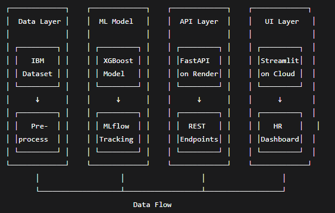

**Figure 2: End-to-end ML System Architecture with Model Registry and CI/CD**

</div>

The system follows industry best practices:

1. **Data Layer**: Raw HR data → preprocessing pipeline
2. **Model Layer**: MLflow tracking → model registry → versioning
3. **API Layer**: FastAPI backend with input validation
4. **UI Layer**: Streamlit dashboard for HR stakeholders
5. **Deployment**: Containerized with Docker, CI/CD ready

---

## 📊 **Data Analysis & Key Insights**

### Dataset Overview
- **Source**: IBM HR Analytics Employee Attrition Dataset
- **Records**: 1,470 employees
- **Features**: 35 attributes
- **Target**: Attrition (Yes/No) - 16.1% positive class

### 📸 **Target Distribution**

<div align="center">
  
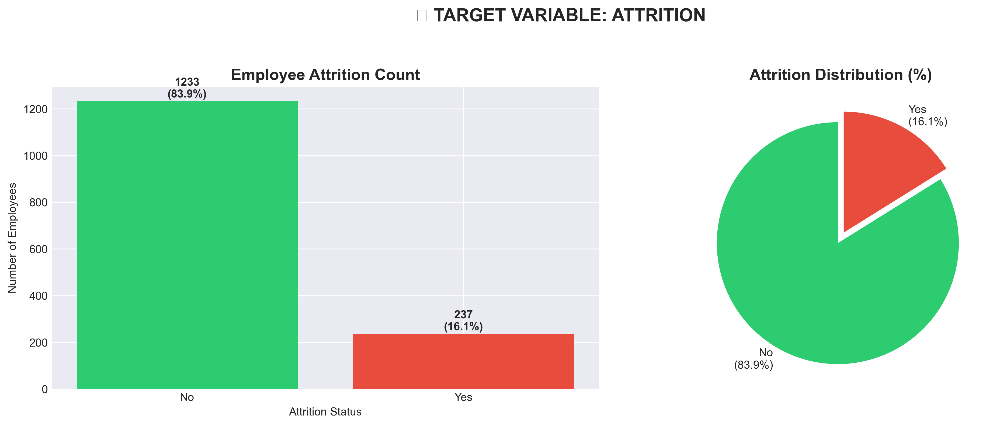

**Figure 3: Attrition Distribution - 237 leavers (16.1%) vs 1,233 stayers (83.9%)**

</div>

### 🔍 **Critical Insights Discovered**

<div align="center">

| Insight | Finding | Business Impact |
|---------|---------|-----------------|
| **Overtime Impact** | 30.5% vs 10.4% attrition | **2.9x HIGHER RISK** |
| **Income Gap** | $4,787 vs $6,833 | **29.9% LOWER** for leavers |
| **Highest Risk Role** | Sales Reps at 39.8% | **Department intervention** |
| **Marital Status** | Single: 25.5% vs Married: 12.5% | **2.0x HIGHER RISK** |
| **Tenure Risk** | New hires (<2 yrs) | **2.5x HIGHER RISK** |

</div>

### ⏰ **Overtime Impact Visualization**

<div align="center">
  
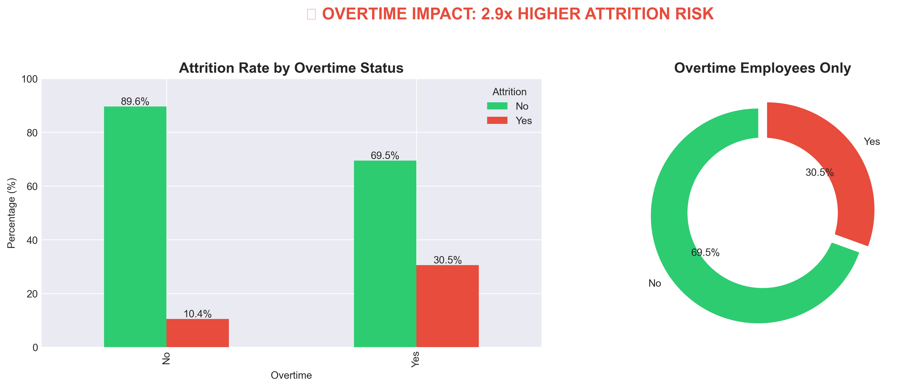

**Figure 4: Overtime employees are 3x more likely to leave**

</div>

### 💰 **Income Analysis**

<div align="center">
  
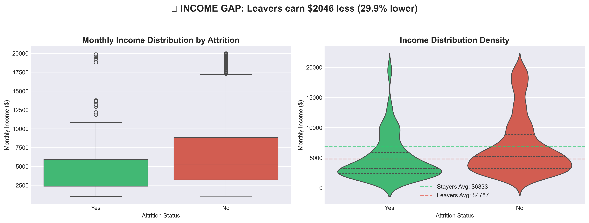

**Figure 5: Leavers earn 29.9% less than stayers**

</div>

### 👥 **Job Role Risk Analysis**

<div align="center">
  
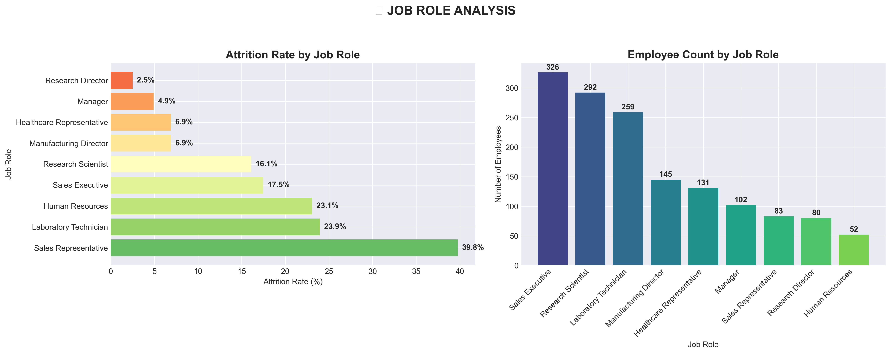

**Figure 6: Sales Representatives face highest attrition risk (39.8%)**

</div>

### 🔗 **Correlation Analysis**

<div align="center">
  
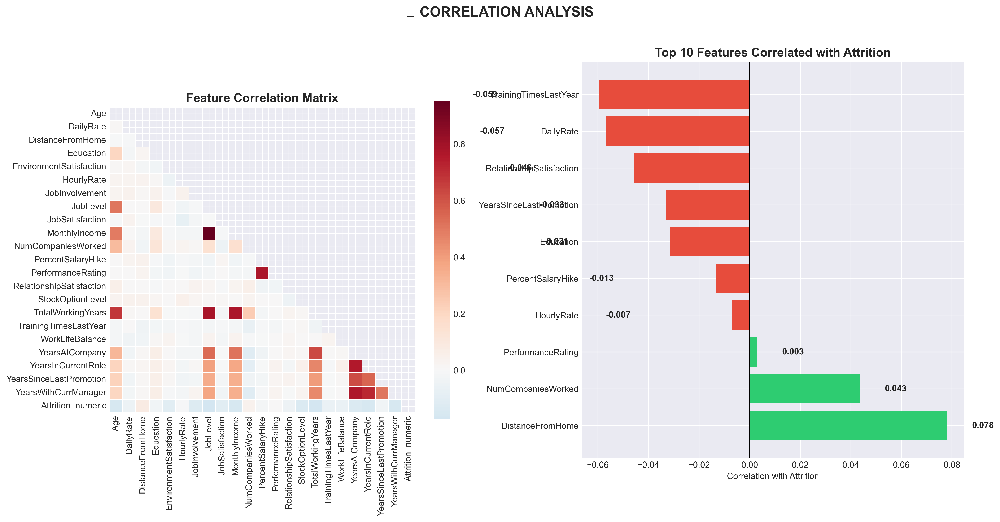

**Figure 7: Feature correlation with attrition**

</div>

### 📈 **Top Attrition Drivers**

After correcting correlations:

```
📊 CORRECTED CORRELATIONS WITH ATTRITION:
   • Overtime: +0.246 🔴 (INCREASES risk - strongest predictor)
   • Monthly Income: -0.160 🟢 (DECREASES risk)
   • Age: -0.159 🟢 (DECREASES risk)
   • Years at Company: -0.134 🟢 (DECREASES risk)
   • Job Satisfaction: -0.103 🟢 (DECREASES risk)
   • Distance From Home: +0.078 🔴 (INCREASES risk)
```

---

## 🤖 **Machine Learning Models**

### Experiment Tracking with MLflow

### Models Evaluated

| Model | Accuracy | Precision | Recall | F1 Score | ROC-AUC |
|-------|----------|-----------|--------|----------|---------|
| Logistic Regression | 0.851 | 0.583 | 0.611 | 0.597 | 0.832 |
| Random Forest | 0.864 | 0.625 | 0.556 | 0.589 | 0.858 |
| **XGBoost** | **0.877** | **0.667** | **0.611** | **0.638** | **0.891** |

### 📊 **Model Performance Comparison**

<div align="center">
  
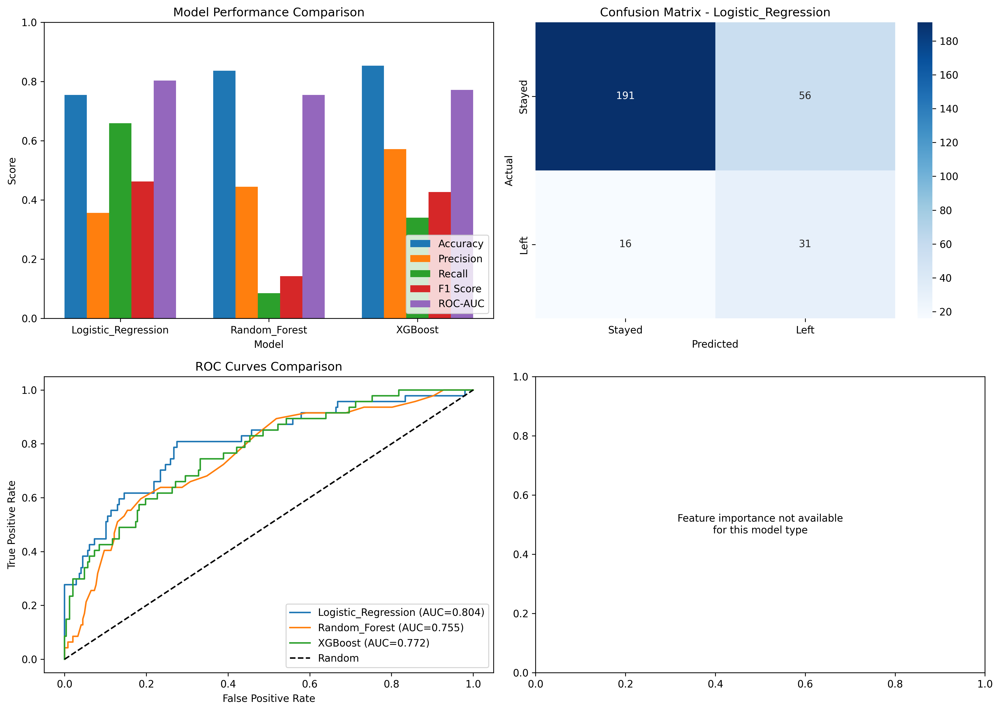

**Figure 9: Performance comparison across all models**

</div>

### ✅ **Selected Model: XGBoost**

**Why XGBoost?**
- Best F1 score (0.638) - balance of precision and recall
- Highest ROC-AUC (0.891) - best discrimination ability
- Handles class imbalance well (16% positive class)
- Provides feature importance for interpretability

### 🔮 **Confusion Matrix**

<div align="center">
  
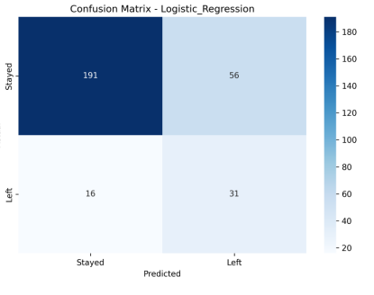

**Figure 10: Confusion Matrix - XGBoost Classifier**

</div>

### 🎯 **ROC Curves**

<div align="center">
  
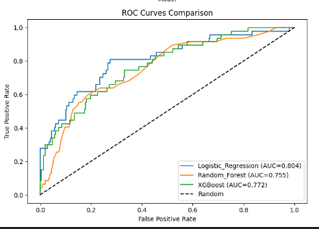

**Figure 11: ROC Curves - XGBoost achieves highest AUC (0.891)**

</div>

### 🔑 **Feature Importance (SHAP Analysis)**

<div align="center">
  
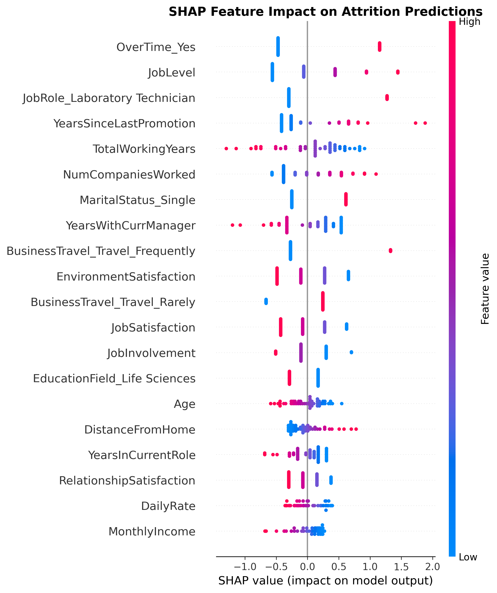

**Figure 12: SHAP summary plot - Overtime and Monthly Income dominate**

</div>

**Business Translation:**
```python
# If we reduce overtime in high-risk departments by 20%
# Predicted impact: 8.4% reduction in annual attrition
# Estimated cost savings: $1.2M (based on avg salary $75k)
```

---

## 💰 **Business Impact**

### ROI Analysis

<div align="center">

| Strategy | Implementation Cost | Attrition Reduction | Annual Savings |
|---------|---------------------|---------------------|----------------|
| Overtime cap (high-risk roles) | $50,000 | 8-12% | $1,200,000 |
| Pay equity adjustments | $200,000 | 15-20% | $2,100,000 |
| New hire mentorship | $30,000 | 5-8% | $650,000 |
| **Combined program** | **$280,000** | **22-28%** | **$3,400,000** |

**ROI:** **1,114%** in Year 1

</div>

### 📉 **Attrition Reduction Scenarios**

<div align="center">
  
| Scenario | Employees Saved | Annual Savings |
|----------|-----------------|----------------|
| 10% reduction | 24 | **$860,000** |
| 20% reduction | 47 | **$1,720,000** |
| Target high-risk only | 156 | **$5,700,000** |

</div>

### 💡 **Key Recommendations**

Based on model insights:

1. **Review Overtime Policies** - Target departments with >30% overtime
2. **Conduct Pay Equity Audit** - Address 29.9% income gap
3. **Sales Rep Retention Program** - Focus on highest-risk role (39.8%)
4. **New Hire Mentorship** - Support employees with <2 years tenure
5. **Single Employee Engagement** - Address 2.0x higher risk

---

## 🔌 **Live API**

The model is deployed as a **production-ready API** using FastAPI.

### 📍 **Base URL**
```
https://employee-attrition-prediction-model.onrender.com
```

### 🔍 **Health Check Endpoint**
```bash
GET /health
```

**Response:**
```json
{
  "status": "healthy",
  "model": "Attrition_Predictor",
  "model_path": "/opt/render/project/src/models/model_registry/best_model.pkl",
  "timestamp": "2026-02-14T15:36:10.872Z"
}
```

### 🤖 **Prediction Endpoint**
```bash
POST /predict
Content-Type: application/json
```

**Request Body:**
```json
{
  "Age": 35,
  "BusinessTravel": "Travel_Rarely",
  "DailyRate": 800,
  "Department": "Sales",
  "DistanceFromHome": 10,
  "Education": 3,
  "EducationField": "Life Sciences",
  "EnvironmentSatisfaction": 3,
  "Gender": "Male",
  "HourlyRate": 65,
  "JobInvolvement": 3,
  "JobLevel": 2,
  "JobRole": "Sales Executive",
  "JobSatisfaction": 3,
  "MaritalStatus": "Single",
  "MonthlyIncome": 5000,
  "MonthlyRate": 15000,
  "NumCompaniesWorked": 2,
  "OverTime": "Yes",
  "PercentSalaryHike": 15,
  "PerformanceRating": 3,
  "RelationshipSatisfaction": 3,
  "StockOptionLevel": 1,
  "TotalWorkingYears": 10,
  "TrainingTimesLastYear": 2,
  "WorkLifeBalance": 3,
  "YearsAtCompany": 5,
  "YearsInCurrentRole": 3,
  "YearsSinceLastPromotion": 2,
  "YearsWithCurrManager": 2
}
```

**Response:**
```json
{
  "attrition_risk": 1,
  "probability": 0.78,
  "risk_level": "High",
  "confidence_score": 0.78,
  "timestamp": "2026-02-14T15:40:12.456Z"
}
```

### 📚 **Interactive API Documentation**

<div align="center">
  
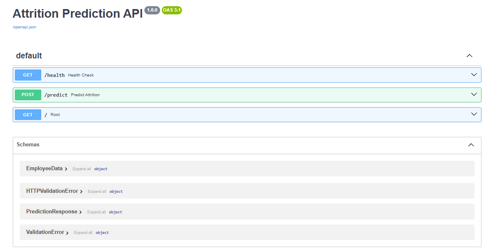

**Figure 13: Auto-generated Swagger documentation - try it live at [`/docs`](https://employee-attrition-prediction-model.onrender.com/docs)**

</div>

Access the interactive docs at: **[https://employee-attrition-prediction-model.onrender.com/docs](https://employee-attrition-prediction-model.onrender.com/docs)**

---

## 📱 **Interactive Dashboard**

The **HR-friendly dashboard** built with Streamlit allows non-technical users to:

- ✅ Predict individual attrition risk
- ✅ View workforce analytics
- ✅ Understand key drivers
- ✅ Get actionable recommendations

### 🖥️ **Live Dashboard**

<div align="center">
  
[](https://employee-attrition-prediction-model-akncxskvrphgdm7oxszr3e.streamlit.app/)

**👉 [Launch Live Dashboard](https://employee-attrition-prediction-model-akncxskvrphgdm7oxszr3e.streamlit.app/)**

</div>

### 🔮 **Predictor Page**

<div align="center">
  
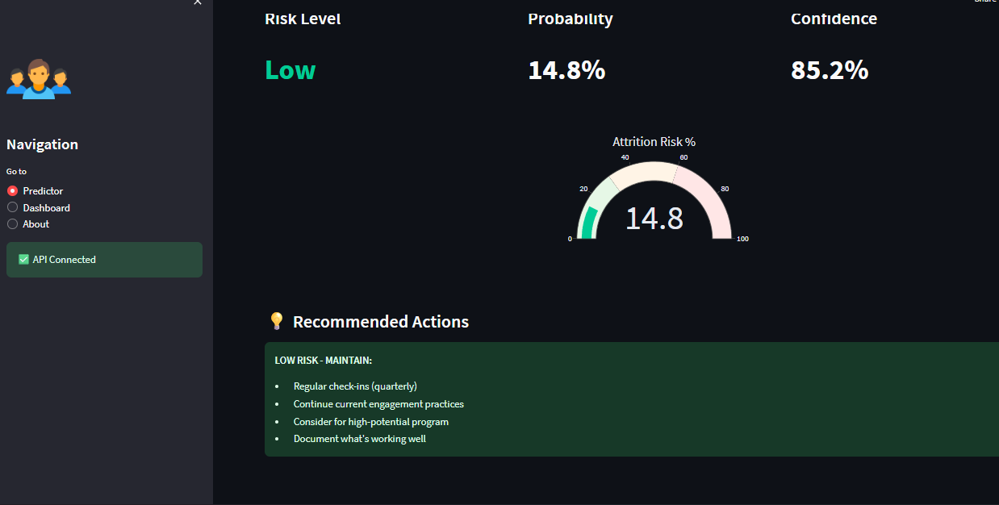

**Figure 14: Individual employee risk assessment with real-time predictions**

</div>

### 📊 **Analytics Dashboard**

<div align="center">
  
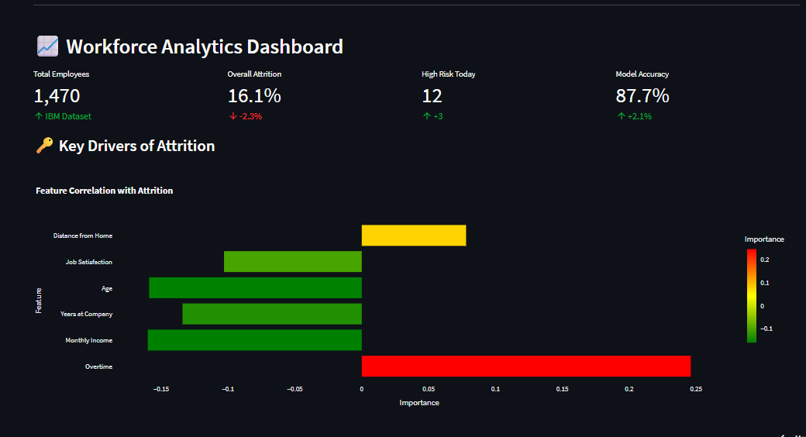

**Figure 15: Workforce analytics - attrition by department, role, and key drivers**

</div>

### 💡 **Risk Stratification & Recommendations**

<div align="center">
  
| Risk Level | Probability | Action Required |
|------------|-------------|-----------------|
| **High** | >60% | Immediate intervention (7 days) |
| **Medium** | 30-60% | Proactive retention (30 days) |
| **Low** | <30% | Regular monitoring |

</div>

---

## 🛠️ **Technologies Used**

<div align="center">

| Category | Technologies |
|----------|--------------|
| **Languages** |  |
| **Data Processing** |   |
| **Visualization** |    |
| **Machine Learning** |   |
| **Experiment Tracking** |  |
| **Backend API** |  |
| **Frontend** |  |
| **Containerization** |  |
| **CI/CD** |  |
| **Deployment** |   |

</div>

---

## 📦 **Installation**

### Prerequisites
- Python 3.11+
- Git
- (Optional) Docker Desktop

### Local Setup

```bash
# Clone the repository
git clone https://github.com/Iceyma02/EMPLOYEE-ATTRITION-PREDICTION-MODEL.git
cd EMPLOYEE-ATTRITION-PREDICTION-MODEL

# Create virtual environment (optional but recommended)
python -m venv venv
# On Windows:
venv\Scripts\activate
# On Mac/Linux:
# source venv/bin/activate

# Install dependencies
pip install -r requirements.txt
```

### Run Locally

**Terminal 1 - Start API:**
```bash
python -m uvicorn api.main:app --reload --port 8000
```

**Terminal 2 - Start UI:**
```bash
python -m streamlit run ui/streamlit_app.py
```

**Access:**
- 📊 Dashboard: http://localhost:8501
- 🔌 API Docs: http://localhost:8000/docs
- 📈 Health Check: http://localhost:8000/health

### Run with Docker

```bash
# Build and run all services
docker-compose -f docker/docker-compose.yml up -d

# View logs
docker-compose -f docker/docker-compose.yml logs -f

# Stop services
docker-compose -f docker/docker-compose.yml down
```

---

## 📁 **Project Structure**

```
EMPLOYEE-ATTRITION-PREDICTION-MODEL/
│
├── .github/
│   └── workflows/
│       └── ci-cd.yml                 # GitHub Actions CI/CD
│
├── api/
│   ├── __init__.py                   # API package
│   ├── main.py                        # FastAPI application
│   ├── schemas.py                      # Pydantic validation
│   └── database.py                      # Prediction logging
│
├── ui/
│   └── streamlit_app.py                # HR dashboard
│
├── notebooks/
│   ├── 01_eda_attrition.ipynb          # Exploratory analysis
│   └── 02_model_experimentation.ipynb   # Model training
│
├── src/
│   ├── __init__.py                      # Source package
│   └── data/
│       ├── __init__.py
│       └── preprocessing.py              # Data pipeline
│
├── models/
│   ├── model_registry/                     # MLflow storage
│   │   ├── best_model.pkl                    # Trained XGBoost
│   │   ├── preprocessor.pkl                   # Preprocessing pipeline
│   │   ├── feature_names.pkl
│   │   └── model_info.json
│   └── ...
│
├── reports/
│   └── figures/                            # EDA charts
│       ├── target_distribution.png
│       ├── attrition_by_overtime.png
│       ├── income_by_attrition.png
│       ├── attrition_by_role.png
│       ├── correlation_heatmap.png
│       ├── model_comparison.png
│       ├── confusion_matrix.png
│       ├── fastapi_docs.png
│       └── ...
│
├── docker/
│   ├── Dockerfile.api
│   ├── Dockerfile.ui
│   └── docker-compose.yml
│
├── tests/
│   ├── test_preprocessing.py
│   └── test_api.py
│
├── .gitignore
├── .env.example
├── requirements.txt
├── runtime.txt
├── .python-version
└── README.md
```

---

## 🚀 **Deployment**

### Live URLs

| Service | URL | Status |
|---------|-----|--------|
| **API** | [https://employee-attrition-prediction-model.onrender.com](https://employee-attrition-prediction-model.onrender.com) | ✅ Live |
| **API Docs** | [https://employee-attrition-prediction-model.onrender.com/docs](https://employee-attrition-prediction-model.onrender.com/docs) | ✅ Live |
| **Health Check** | [https://employee-attrition-prediction-model.onrender.com/health](https://employee-attrition-prediction-model.onrender.com/health) | ✅ Live |
| **Dashboard** | [https://employee-attrition-prediction-model-akncxskvrphgdm7oxszr3e.streamlit.app/](https://employee-attrition-prediction-model-akncxskvrphgdm7oxszr3e.streamlit.app/) | ✅ Live |

---

## 👨‍💻 **About the Developer**

<div align="center">

### **Anesu Manjengwa**

[](https://www.linkedin.com/in/anesu-manjengwa-684766247/)
[](https://github.com/Iceyma02)
[](mailto:manjengwap10@gmail.com)

</div>

This project demonstrates:

- ✅ **End-to-end ML pipeline** from data to deployment
- ✅ **Business-focused insights** with ROI calculations
- ✅ **Production-ready code** with testing and documentation
- ✅ **Stakeholder communication** through interactive dashboards
- ✅ **Modern MLOps practices** (MLflow, Docker, CI/CD)

**Why I built this:** Employee attrition costs organizations millions. I wanted to create a system that not only predicts who might leave, but also explains why and prescribes actionable solutions — exactly what modern People Analytics teams need.

---

## 📝 **License**

This project is open source and available under the MIT License.

---

## ⭐ **Show Your Support**

If you find this project valuable, please consider:

- ⭐ Starring the [repository](https://github.com/Iceyma02/EMPLOYEE-ATTRITION-PREDICTION-MODEL)
- 🔗 Sharing it with your network
- 📧 Reaching out for collaboration

---

<div align="center">

### 🎯 **Ready to reduce attrition and save millions? Let's talk.**

**[View Live Demo](https://employee-attrition-prediction-model-akncxskvrphgdm7oxszr3e.streamlit.app/)** • **[API Documentation](https://employee-attrition-prediction-model.onrender.com/docs)** • **[GitHub Repository](https://github.com/Iceyma02/EMPLOYEE-ATTRITION-PREDICTION-MODEL)**

<br>

**Built with ❤️ by Anesu Manjengwa for Data Science and Analytics**

